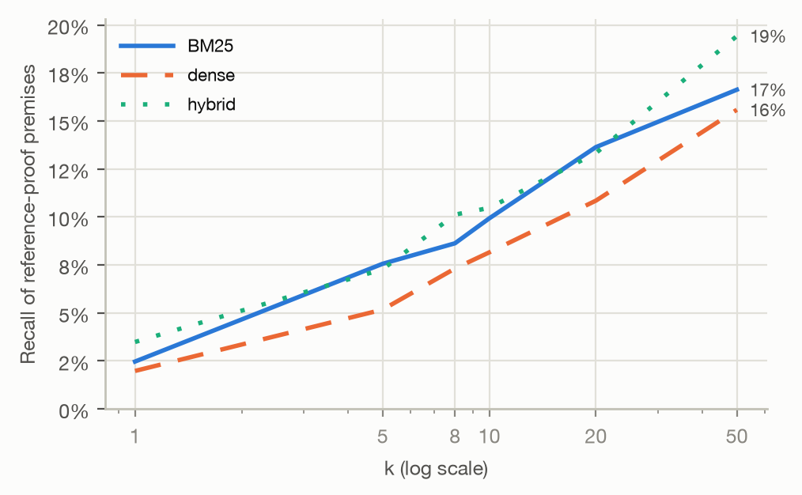
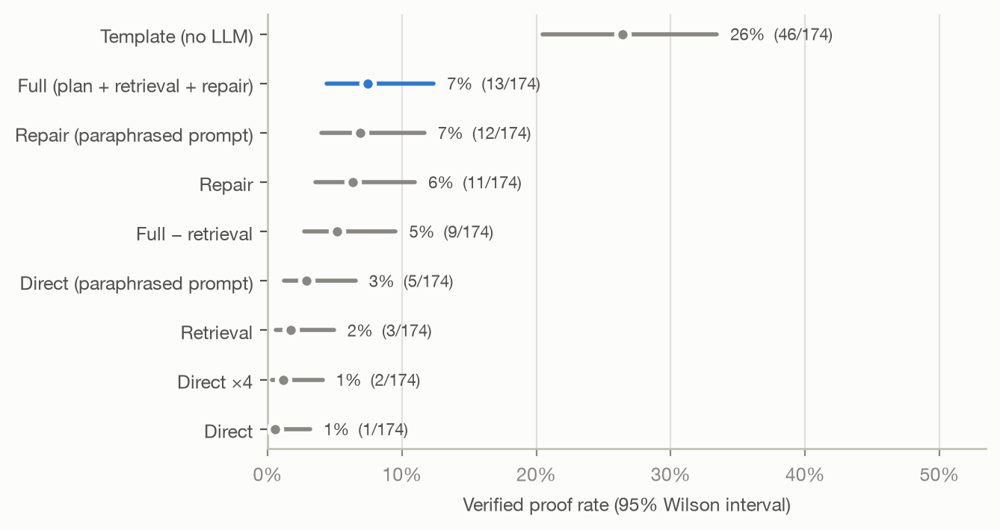
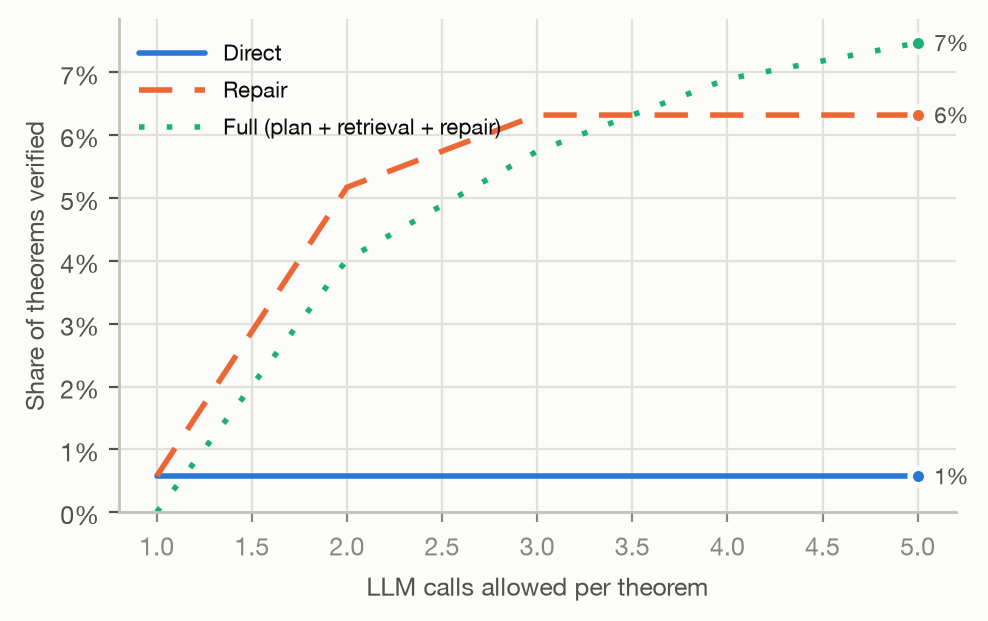
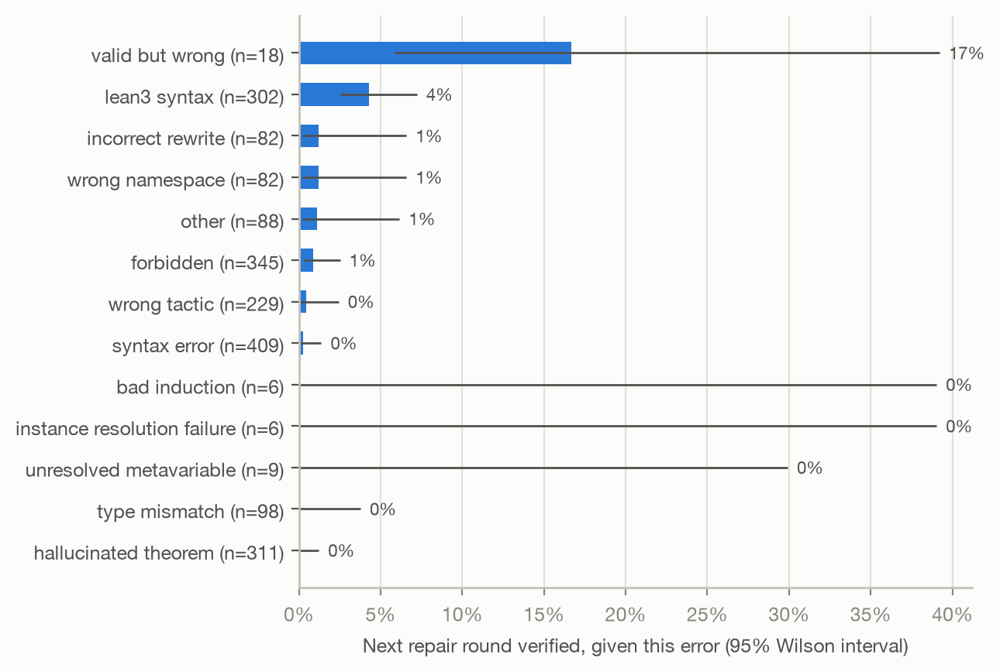
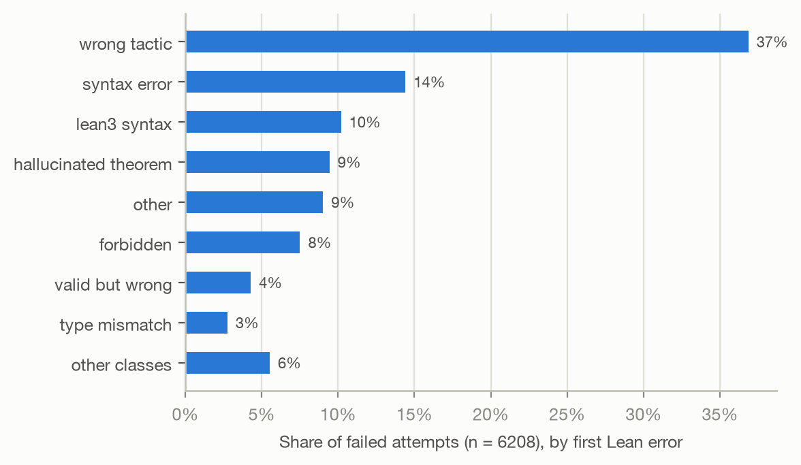
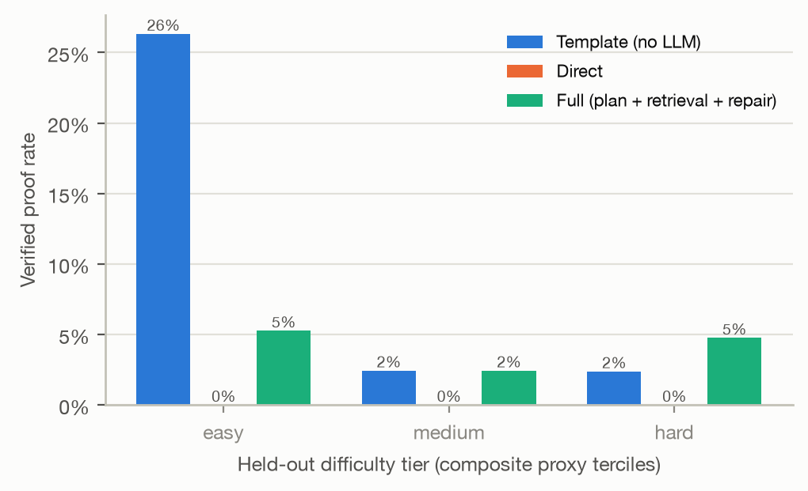
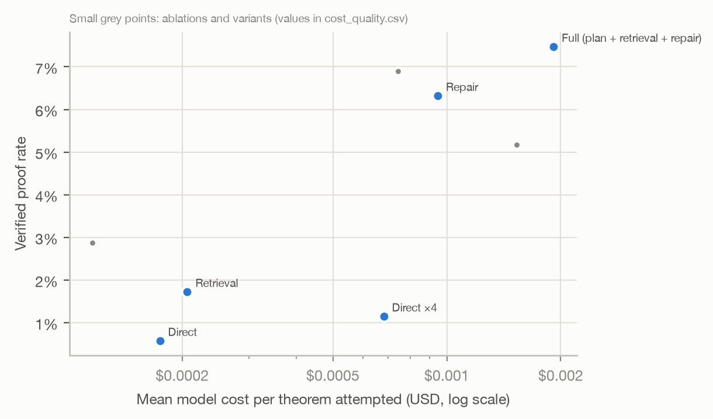

# LeanGraph: Evaluating Retrieval and Verifier-Guided Repair for LLM Theorem Proving

## Abstract

We ask when verifier-guided agentic reasoning improves formal proof generation over direct generation by a language model. LeanGraph poses 203 Lean 4 theorems (150 held out from Mathlib by module boundary, with every downstream module banned, and 53 written for the study) to one open-weight model under 9 configurations that switch retrieval, planning and compiler-feedback repair on and off. A proof counts only if a fresh Lean process accepts it with standard axioms and no banned premise. The best configuration, planning, retrieval and repair, verified 7.5%. Direct generation verified 0.6%; a fixed list of automation tactics with no model verified 26.4%. The full agent's advantage over direct generation is statistically reliable (difference +6.9 points, Holm p = 0.00342). Against independent resampling at the same number of model calls, repair differs reliably (+5.2 points, Holm p = 0.0195).

**Status of this version.** Interim: 9 of 15 configurations are complete. Still running: retrieval with repair, BM25 retrieval with repair, dense retrieval with repair, the full agent without compiler feedback, the full agent without memory of earlier attempts, the full agent without a proof skeleton. Contrasts that need them are omitted, and the Holm adjustment covers only the contrasts reported here; both change when the grid is complete.

## 1 Introduction

Language models write text that looks like mathematics. A proof assistant removes the need to judge whether it is: Lean either accepts a proof or it does not. That makes formal proving an unusually clean setting for a question about agents in general: when does wrapping a model in retrieval, planning and feedback from a verifier produce more correct output than asking it once? We answer it for one model under a harness designed so that nothing but Lean's verdict counts, and we report negative and null results with the same weight as positive ones.

Research questions: (RQ1) Does retrieval of Mathlib lemmas help? (RQ2) Does compiler-feedback repair help, and does it beat spending the same calls on fresh samples? (RQ3) Does planning help beyond retrieval? (RQ4) Which Lean error classes are repairable? (RQ5) How does success fall with difficulty? (RQ6) Can cheaper inference with strong scaffolding compete with more expensive inference? (RQ7) What does a verified theorem cost?

## 2 Related Work

**Neural theorem proving in interactive provers.** Language models were first used to propose proof steps for
Metamath by Polu and Sutskever [1], then for Lean with co-training on proof artifacts [2]. Search-based provers
combine a step model with tree search [3, 4]. Draft-Sketch-Prove turns informal proofs into formal sketches whose
gaps are closed by automation [5]; Thor delegates sub-goals to hammers [6]. Whole-proof generation with repair from
prover errors was studied by Baldur for Isabelle [7], and COPRA frames proving as an in-context agent that sees
prover feedback [8]. Large-scale synthetic data and reinforcement learning from proof-assistant feedback drive the
DeepSeek-Prover line [9, 10].

**Retrieval of premises.** LeanDojo released Lean tooling, a benchmark with a novel-premises split, and ReProver, a
retrieval-augmented prover [11]; Magnushammer studied premise selection with contrastive training [12]. Our retriever
comparison uses classical BM25 [13], a general-purpose dense embedder not trained on Mathlib [14], and reciprocal-rank
fusion [15], so that no retriever has seen held-out premises in training.

**Benchmarks.** miniF2F [16], ProofNet [17] and PutnamBench [18] measure competition and textbook mathematics.
LeanGraph instead samples held-out statements from Mathlib itself, split by module boundary with everything
downstream banned, and adds statements written for the study, so that success can be compared between theorems
whose proofs could be remembered and theorems whose proofs could not.

**Self-repair and budgets.** Iterative refinement from feedback helps language models in several domains [19, 20],
but for code generation repair is not always better than drawing fresh samples at equal cost [21]. We therefore
compare repair against independent resampling at the same number of model calls, and report success as a function
of calls (pass@k in the sense of [22]).

## 3 Benchmark

**Composition.** 203 theorems: algebra 35, category theory 29, functions 13, inequalities 35, number theory 35, probability 29, sets 27. Held-out: 121 test and 29 development theorems (the development split was used only to design prompts). Authored: 53 theorems, each with a reference proof accepted by the certifier.

**Held-out by module boundary.** We parse the import graph of the pinned Mathlib and keep a module only if at most twenty modules depend on it and none of them implements a tactic. For a theorem from module M, the prover may use no constant from M or from any module that transitively imports M, and the retriever never indexes them. Theorems whose statement mentions a banned constant are dropped, since their unfolding lemmas would be banned as well. Each statement is Lean's own pretty-printed signature, kept only if Lean confirms that the rendered statement has exactly the original theorem's type. Modules are assigned wholesale to development or test, and sampling round-robins across modules with at most three theorems per module. Selection never consults any prover's result.

**Difficulty.** For held-out theorems, a composite proxy averages z-scores of Mathlib's reference-proof length, number of premises used, tactic diversity, statement expression depth and statement length; terciles define easy, medium and hard. Authored theorems carry the author's label, assigned before any model was run.

## 4 Lean Environment

Lean 4.33.1 and Mathlib v4.33.1 (commit 0df444a3), pinned by `lake-manifest.json`; the Lean REPL from leanprover-community at a recorded commit, built against the same toolchain. Every theorem is elaborated under `maxHeartbeats 200000`. Search-time checks run in a long-lived REPL holding Mathlib in memory; the verdict comes from a separate certification in a fresh `lean` process that prints, under a random per-run nonce, the axioms the proof depends on, every constant its proof term uses with its module, and every declaration the file added. A proof is verified only if the file compiles without errors or `sorry`, depends on no axiom beyond propext, Classical.choice and Quot.sound, adds no declaration besides the target and its auxiliaries, and uses no banned constant. Proof text containing `sorry`, `admit`, `axiom`, `native_decide`, `set_option`, metaprogramming or top-level commands is rejected before compilation; tests show the certifier rejects each of these attacks on its own with that filter disabled. Lean's heartbeat limit did not stop every runaway tactic in our tests, so a 60-second wall-clock backstop remains; timeouts from it depend on the machine.

## 5 Retrieval

The index holds every Mathlib theorem (signature and docstring) outside the banned modules. We compare BM25, a dense retriever (bge-small-en-v1.5, not trained on Mathlib) and their reciprocal-rank fusion. Ground truth is the set of indexed theorems used by each theorem's reference proof; recall counts reachable premises only.

| Retriever | Theorems | MRR | Recall@8 | Recall@20 | Recall@50 |
|---|---:|---:|---:|---:|---:|
| bm25 | 164 | 0.117 | 8.6% | 13.6% | 16.6% |
| dense | 164 | 0.088 | 7.3% | 10.8% | 15.6% |
| hybrid | 164 | 0.125 | 10.1% | 13.3% | 19.4% |

## 6 Agent Architectures

All configurations are one loop. *Direct*: one draft. *Direct ×4*: four independent drafts, the equal-budget control for repair. *Repair*: a draft plus up to three rounds in which the model sees its previous proof and exactly what Lean printed. *Retrieval*: eight retrieved lemmas in the prompt. *Full*: a planning call that writes an informal sketch and a Lean `have` skeleton, which Lean type-checks with `sorry` allowed, followed by retrieval and repair. Ablations remove retrieval, compiler feedback (the model is told only that the proof failed), memory (only the latest attempt is shown) or the skeleton (informal plan only). Model draws are cached under a hash of the prompt and sample index, so identical prompts across configurations share a draw and comparisons are paired. The gateway's generation turned out to be nearly deterministic for a given request, whatever the temperature, so each resampled draw in Direct ×4 (samples 2–4) sends a fixed seed (1001–1003); first drafts and repair rounds send none.

## 7 Evaluation

The primary metric is the share of theorems verified. Intervals are 95% Wilson intervals; differences between configurations are paired over theorems, with percentile-bootstrap intervals and exact McNemar tests, Holm-adjusted across all pre-registered contrasts. Secondary metrics: success within N model calls, calls to first success, Lean time, tokens and provider-reported cost, proof length, retrieval recall inside runs, repair success and timeout rate.

## 8 Results

| Configuration | Verified | Rate [95% CI] | ≤1 call | ≤4 calls | Cost / verified |
|---|---:|---:|---:|---:|---:|
| template automation (no LLM) | 46/174 | 26.4% [20.4%, 33.4%] | 26.4% | 26.4% | n/a |
| planning, retrieval and repair | 13/174 | 7.5% [4.4%, 12.4%] | 0.0% | 6.9% | $0.0256 |
| repair with the paraphrased prompt | 12/174 | 6.9% [4.0%, 11.7%] | 2.9% | 6.9% | $0.0108 |
| direct generation with compiler-feedback repair | 11/174 | 6.3% [3.6%, 11.0%] | 0.6% | 6.3% | $0.0150 |
| the full agent without retrieval | 9/174 | 5.2% [2.7%, 9.5%] | 0.0% | 5.2% | $0.0295 |
| direct generation with the paraphrased prompt | 5/174 | 2.9% [1.2%, 6.5%] | 2.9% | 2.9% | $0.0040 |
| retrieval-augmented generation | 3/174 | 1.7% [0.6%, 4.9%] | 1.7% | 1.7% | $0.0120 |
| four independent drafts | 2/174 | 1.1% [0.3%, 4.1%] | 0.6% | 1.1% | $0.0593 |
| direct generation | 1/174 | 0.6% [0.1%, 3.2%] | 0.6% | 0.6% | $0.0304 |

- **Primary: full agent vs direct generation.** planning, retrieval and repair verified 7.5% and direct generation 0.6% of the same 174 theorems (difference +6.9 points, 95% CI [+3.4, +10.9]; 12 theorems solved only by the first, 0 only by the second; exact McNemar p = 0.000488, Holm-adjusted p = 0.00342). The difference survives correction: planning, retrieval and repair outperforms direct generation.
- **RQ2 compiler-feedback repair vs one draft.** direct generation with compiler-feedback repair verified 6.3% and direct generation 0.6% of the same 174 theorems (difference +5.7 points, 95% CI [+2.3, +9.2]; 10 theorems solved only by the first, 0 only by the second; exact McNemar p = 0.00195, Holm-adjusted p = 0.0117). The difference survives correction: direct generation with compiler-feedback repair outperforms direct generation.
- **RQ2 repair vs independent resampling at equal LLM calls.** direct generation with compiler-feedback repair verified 6.3% and four independent drafts 1.1% of the same 174 theorems (difference +5.2 points, 95% CI [+2.3, +8.6]; 9 theorems solved only by the first, 0 only by the second; exact McNemar p = 0.00391, Holm-adjusted p = 0.0195). The difference survives correction: direct generation with compiler-feedback repair outperforms four independent drafts.
- **RQ1 retrieval, single draft.** retrieval-augmented generation verified 1.7% and direct generation 0.6% of the same 174 theorems (difference +1.1 points, 95% CI [-1.1, +3.4]; 3 theorems solved only by the first, 1 only by the second; exact McNemar p = 0.625, Holm-adjusted p = 1). At this sample size the data cannot distinguish the two.
- **LLM vs no-LLM automation.** direct generation verified 0.6% and template automation (no LLM) 26.4% of the same 174 theorems (difference -25.9 points, 95% CI [-32.2, -19.5]; 0 theorems solved only by the first, 45 only by the second; exact McNemar p = 5.68e-14, Holm-adjusted p = 4.55e-13). The difference survives correction: direct generation underperforms template automation (no LLM).
- **Prompt sensitivity: paraphrased prompt, direct.** direct generation with the paraphrased prompt verified 2.9% and direct generation 0.6% of the same 174 theorems (difference +2.3 points, 95% CI [+0.6, +4.6]; 4 theorems solved only by the first, 0 only by the second; exact McNemar p = 0.125, Holm-adjusted p = 0.5). At this sample size the data cannot distinguish the two.
- **Prompt sensitivity: paraphrased prompt, repair.** repair with the paraphrased prompt verified 6.9% and direct generation with compiler-feedback repair 6.3% of the same 174 theorems (difference +0.6 points, 95% CI [+0.0, +1.7]; 1 theorems solved only by the first, 0 only by the second; exact McNemar p = 1, Holm-adjusted p = 1). At this sample size the data cannot distinguish the two.

**Ablations.** Each removes one part of the full agent:

- Ablation: retrieval: planning, retrieval and repair verified 7.5% and the full agent without retrieval 5.2% of the same 174 theorems (difference +2.3 points, 95% CI [-1.7, +6.3]; 9 theorems solved only by the first, 5 only by the second; exact McNemar p = 0.424, Holm-adjusted p = 1). At this sample size the data cannot distinguish the two.

**Held-out versus authored theorems.**
- direct generation: 0.0% on held-out Mathlib theorems vs 1.9% on authored theorems.
- planning, retrieval and repair: 4.1% on held-out Mathlib theorems vs 15.1% on authored theorems.

## 9 Repair Dynamics

- direct generation with compiler-feedback repair: of 173 theorems whose first draft failed, 5.8% were later verified.
- planning, retrieval and repair: of 167 theorems whose first draft failed, 3.6% were later verified.

Next-round success by the class of the error being repaired (classes with at least five cases):

| First error | Cases | Next round verified |
|---|---:|---:|
| valid but wrong | 18 | 16.7% |
| lean3 syntax | 302 | 4.3% |
| wrong namespace | 82 | 1.2% |
| incorrect rewrite | 82 | 1.2% |
| other | 88 | 1.1% |
| forbidden | 345 | 0.9% |
| wrong tactic | 229 | 0.4% |
| syntax error | 409 | 0.2% |
| hallucinated theorem | 311 | 0.0% |
| type mismatch | 98 | 0.0% |
| unresolved metavariable | 9 | 0.0% |
| instance resolution failure | 6 | 0.0% |
| bad induction | 6 | 0.0% |

## 10 Error Analysis

We classify all 6208 failed attempts by their first Lean error; unknown names are split into hallucinated and wrong-namespace by lookup in the table of all 473,141 constants of the pinned Mathlib.

| Class | Attempts | Share |
|---|---:|---:|
| wrong tactic | 2288 | 36.9% |
| syntax error | 895 | 14.4% |
| lean3 syntax | 633 | 10.2% |
| hallucinated theorem | 586 | 9.4% |
| other | 560 | 9.0% |
| forbidden | 466 | 7.5% |
| valid but wrong | 266 | 4.3% |
| type mismatch | 171 | 2.8% |
| wrong namespace | 154 | 2.5% |
| incorrect rewrite | 144 | 2.3% |
| instance resolution failure | 23 | 0.4% |
| unresolved metavariable | 12 | 0.2% |
| bad induction | 8 | 0.1% |
| checker rejected | 1 | 0.0% |
| timeout | 1 | 0.0% |

**Difficulty.** Spearman correlation between each proxy and a held-out theorem's solve rate across all configurations:

| Proxy | ρ | p | n |
|---|---:|---:|---:|
| ref proof lines | -0.33 | 0.000207 | 121 |
| ref tactic diversity | -0.31 | 0.000634 | 121 |
| gt premises reachable | -0.35 | 9.27e-05 | 121 |
| type depth | -0.09 | 0.302 | 121 |
| statement chars | -0.14 | 0.134 | 121 |
| difficulty score | -0.31 | 0.000464 | 121 |
| binder groups | -0.09 | 0.346 | 121 |

## 11 Cost

| Configuration | Model calls | Tokens | Cost | Cost per verified |
|---|---:|---:|---:|---:|
| direct generation with the paraphrased prompt | 174 | 82,020 | $0.0201 | $0.0040 |
| repair with the paraphrased prompt | 670 | 703,436 | $0.1293 | $0.0108 |
| retrieval-augmented generation | 174 | 198,715 | $0.0359 | $0.0120 |
| direct generation with compiler-feedback repair | 675 | 861,900 | $0.1648 | $0.0150 |
| planning, retrieval and repair | 841 | 1,952,639 | $0.3332 | $0.0256 |
| the full agent without retrieval | 844 | 1,405,154 | $0.2657 | $0.0295 |
| direct generation | 174 | 104,753 | $0.0304 | $0.0304 |
| four independent drafts | 691 | 411,650 | $0.1186 | $0.0593 |
| template automation (no LLM) | 0 | 0 | $0.0000 | n/a |

## 12 Limitations and Threats to Validity

- **One model.** Every configuration uses one open-weight model through the owner's gateway, whose documentation names the upstream as Qwen3-8B; we did not verify the upstream independently. No second model or reasoning tier was run, so RQ6 is not answered.
- **Contamination and memorisation.** Mathlib is public and almost certainly in the model's training data. The module ban stops a proof from citing its target or anything built on it, but not from reproducing a remembered proof. The authored split bounds this: those exact statements are not Mathlib declarations, though similar textbook statements surely appear in training data.
- **Distribution.** Held-out modules are near-leaves of the import graph, which skews toward specialised topics; the benchmark is not a uniform sample of Mathlib.
- **Difficulty proxies.** They are computed from Mathlib's reference proofs, which are often golfed term-mode proofs, so they measure a proof's size in Mathlib's style rather than its difficulty for a model.
- **Prompt sensitivity.** A second, paraphrased prompt set was run for direct generation and repair; see the prompt contrasts in Section 8. Two prompt sets bound sensitivity only loosely.
- **Sampling.** Temperature 0.6 with one draw per configuration and theorem (four for Direct ×4). Repeated draws of the same request were nearly deterministic at this gateway: in a first, unseeded Direct ×4 run, all four drafts were identical for 98 of 173 theorems, and a probe got one identical reply at temperatures 0.6 and 1.2. That run is archived as evidence and Direct ×4 was re-run with a distinct seed per resampled draw. The same determinism means every single-draft configuration reflects one fixed draw per prompt; run-to-run variance is not estimated.
- **Context.** The gateway reports an 8,192-token context, which bounds long repair histories and long reasoning traces.
- **Timeouts.** The wall-clock backstop makes a small number of verdicts machine-dependent; heartbeat-limited verdicts are not.

## 13 Reviewer 2

| Objection | What we did | What remains |
|---|---|---|
| Benchmark contamination | Held-out split by module with downstream ban; authored split; target renamed `lg_target` in every prompt | Proof recall from pretraining cannot be ruled out |
| Mathlib leakage | Certifier rejects any constant from the held-out module or anything importing it; statements mentioning banned constants excluded | Mathematically equivalent lemmas elsewhere in Mathlib remain usable, as for a human |
| Model memorisation | Held-out vs authored comparison reported per configuration | Authored statements resemble textbook exercises |
| Theorem difficulty | Composite proxy terciles; correlations per proxy; template baseline as an empirical floor | Proxies reflect Mathlib's proof style |
| Prompt sensitivity | Prompts fixed on the development split; a paraphrased prompt set run for direct and repair | Only two prompt sets |
| Compute unfairness | Direct ×4 at the same call budget as repair; success reported per number of calls; cost per verified theorem | Planning adds one call to the full agent |
| Retriever leakage | Banned modules removed from the index; dense model not trained on Mathlib | — |
| Repair-loop budget | Three rounds fixed in advance; success-within-N curves show every budget up to five calls | Larger budgets untested |

## 14 Conclusion

With Lean as the only judge, the full agent verified reliably more theorems than direct generation (7.5% vs 0.6%). Repair did beat spending the same calls on independent drafts. All traces, prompts, cached model responses and certificates are released so that each number can be recomputed.

## References

Bibliographic details below were entered from the authors' knowledge of the literature and should be checked
against the publishers' records before submission.

1. S. Polu, I. Sutskever. Generative Language Modeling for Automated Theorem Proving. arXiv:2009.03393, 2020.
2. J. M. Han, J. Rute, Y. Wu, E. W. Ayers, S. Polu. Proof Artifact Co-training for Theorem Proving with Language Models. ICLR 2022.
3. S. Polu, J. M. Han, K. Zheng, M. Baksys, I. Babuschkin, I. Sutskever. Formal Mathematics Statement Curriculum Learning. ICLR 2023.
4. G. Lample et al. HyperTree Proof Search for Neural Theorem Proving. NeurIPS 2022.
5. A. Q. Jiang, S. Welleck, J. P. Zhou et al. Draft, Sketch, and Prove: Guiding Formal Theorem Provers with Informal Proofs. ICLR 2023.
6. A. Q. Jiang, W. Li, S. Tworkowski et al. Thor: Wielding Hammers to Integrate Language Models and Automated Theorem Provers. NeurIPS 2022.
7. E. First, M. N. Rabe, T. Ringer, Y. Brun. Baldur: Whole-Proof Generation and Repair with Large Language Models. ESEC/FSE 2023.
8. A. Thakur, G. Tsoukalas, Y. Wen, J. Xin, S. Chaudhuri. An In-Context Learning Agent for Formal Theorem-Proving. COLM 2024.
9. H. Xin et al. DeepSeek-Prover: Advancing Theorem Proving in LLMs through Large-Scale Synthetic Data. arXiv:2405.14333, 2024.
10. H. Xin et al. DeepSeek-Prover-V1.5: Harnessing Proof Assistant Feedback for Reinforcement Learning and Monte-Carlo Tree Search. arXiv:2408.08152, 2024.
11. K. Yang, A. M. Swope, A. Gu et al. LeanDojo: Theorem Proving with Retrieval-Augmented Language Models. NeurIPS 2023 (Datasets and Benchmarks).
12. M. Mikuła et al. Magnushammer: A Transformer-Based Approach to Premise Selection. ICLR 2024.
13. S. Robertson, H. Zaragoza. The Probabilistic Relevance Framework: BM25 and Beyond. Foundations and Trends in Information Retrieval, 2009.
14. S. Xiao, Z. Liu, P. Zhang, N. Muennighoff. C-Pack: Packaged Resources To Advance General Chinese Embedding. arXiv:2309.07597, 2023.
15. G. V. Cormack, C. L. A. Clarke, S. Büttcher. Reciprocal Rank Fusion Outperforms Condorcet and Individual Rank Learning Methods. SIGIR 2009.
16. K. Zheng, J. M. Han, S. Polu. miniF2F: a Cross-System Benchmark for Formal Olympiad-Level Mathematics. ICLR 2022.
17. Z. Azerbayev et al. ProofNet: Autoformalizing and Formally Proving Undergraduate-Level Mathematics. arXiv:2302.12433, 2023.
18. G. Tsoukalas et al. PutnamBench: Evaluating Neural Theorem-Provers on the Putnam Mathematical Competition. NeurIPS 2024 (Datasets and Benchmarks).
19. A. Madaan et al. Self-Refine: Iterative Refinement with Self-Feedback. NeurIPS 2023.
20. N. Shinn et al. Reflexion: Language Agents with Verbal Reinforcement Learning. NeurIPS 2023.
21. T. X. Olausson et al. Is Self-Repair a Silver Bullet for Code Generation? ICLR 2024.
22. M. Chen et al. Evaluating Large Language Models Trained on Code. arXiv:2107.03374, 2021.
23. L. de Moura, S. Ullrich. The Lean 4 Theorem Prover and Programming Language. CADE 2021.
24. The mathlib Community. The Lean Mathematical Library. CPP 2020.
25. Q. McNemar. Note on the sampling error of the difference between correlated proportions or percentages. Psychometrika, 1947.
26. E. B. Wilson. Probable inference, the law of succession, and statistical inference. JASA, 1927.
27. S. Holm. A simple sequentially rejective multiple test procedure. Scandinavian Journal of Statistics, 1979.
